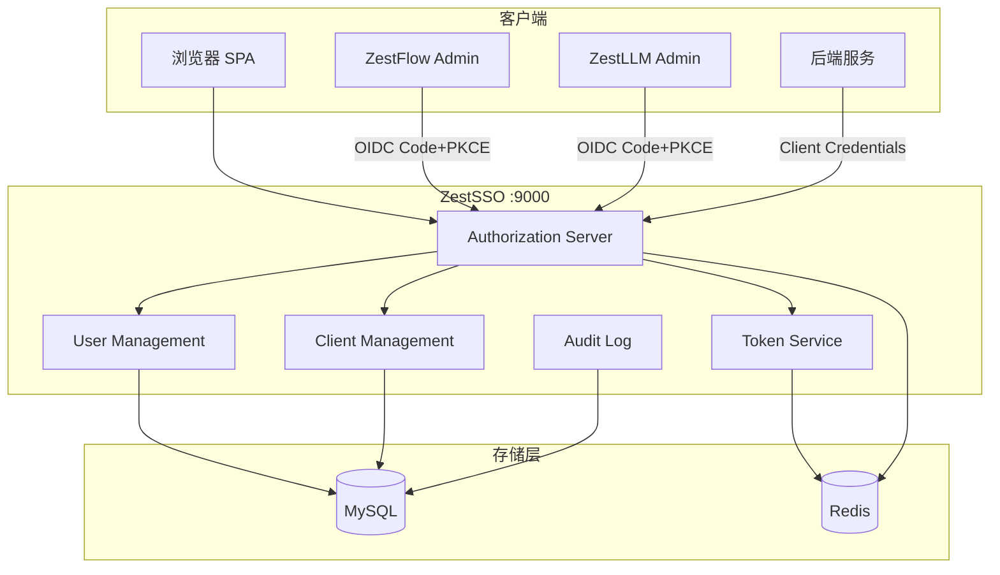
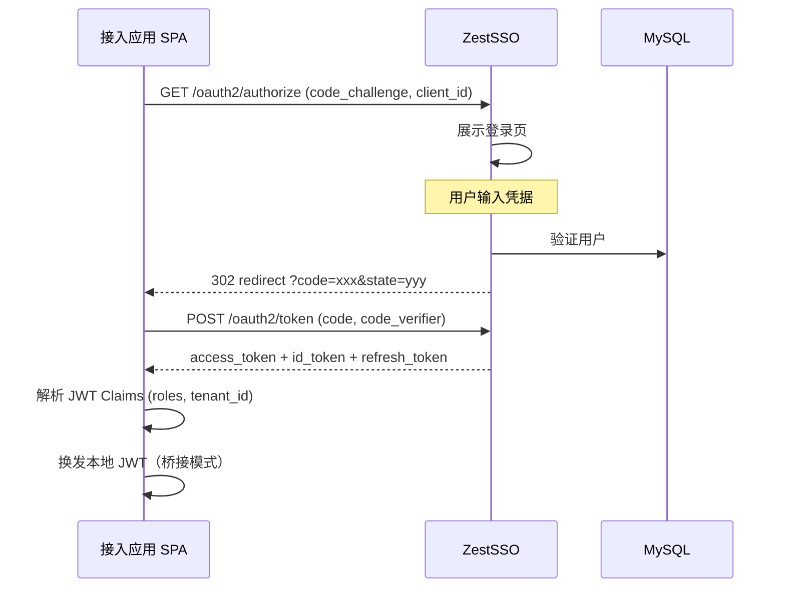
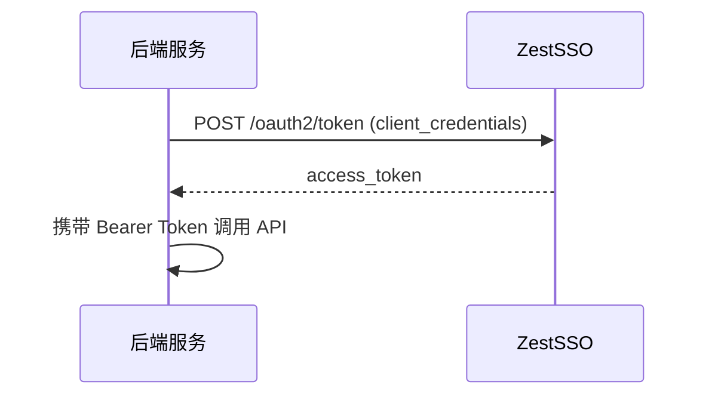

# ZestSSO 架构设计文档

## 1. 概述

ZestSSO 是 Zest 生态的统一身份认证提供者（Identity Provider, IdP），采用 OAuth 2.0 / OpenID Connect 标准协议，为 ZestFlow、ZestLLM 及未来应用提供单点登录能力。

## 2. 需求分析

### 2.1 功能需求

| 编号 | 功能 | 优先级 | 状态 |
|------|------|--------|------|
| F01 | 用户认证（用户名密码） | P0 | 已实现 |
| F02 | OAuth2 Authorization Code + PKCE | P0 | 已实现 |
| F03 | Client Credentials 服务间认证 | P0 | 已实现 |
| F04 | Refresh Token 刷新 | P0 | 已实现 |
| F05 | OIDC Discovery / JWKS | P0 | 已实现 |
| F06 | 用户/角色/租户管理 | P0 | 已实现 |
| F07 | OAuth 客户端注册管理 | P0 | 已实现 |
| F08 | 审计日志 | P1 | 已实现 |
| F09 | Token 吊销 | P1 | 已实现 |
| F10 | MFA/TOTP | P2 | 已实现 |
| F11 | OIDC 身份联邦 | P2 | 已实现 |
| F12 | Admin 控制台 (Vue SPA) | P1 | 已实现 |
| F13 | 会话管理 / 强制下线 | P1 | 已实现 |
| F14 | SAML 2.0 联邦 | P1 | 已实现（`DatabaseRelyingPartyRegistrationRepository`） |
| F15 | SCIM 2.0 用户同步 | P2 | 已实现（`/scim/v2`，scope `scim`） |

### 2.2 非功能需求

| 维度 | 要求 | 实现方案 |
|------|------|----------|
| 高并发 | 支持 1000+ QPS 认证 | Redis 缓存 + HikariCP 连接池 + 异步审计 |
| 高可用 | 99.9% SLA | 无状态设计 + Redis Session + 多实例部署 |
| 安全性 | 企业级安全基线 | BCrypt 密码、RS256 JWT、PKCE、登录限流 |
| 可扩展性 | 新应用快速接入 | 标准 OIDC + Client SDK |
| 可维护性 | 规范代码与文档 | 模块化 + Flyway 迁移 + Swagger |

## 3. 系统架构



## 4. 认证流程

### 4.1 Authorization Code + PKCE（浏览器应用）



### 4.2 Client Credentials（服务间）



## 5. 权限模型

### 5.1 SSO 角色

| 角色 | 编码 | 权限 |
|------|------|------|
| SSO 管理员 | SSO_ADMIN | 全部管理权限 |
| SSO 运维 | SSO_OPERATOR | 用户管理、审计查看 |
| 普通用户 | USER | 仅认证 |

### 5.2 JWT Claims

| Claim | 类型 | 说明 |
|-------|------|------|
| sub | String | 用户 ID |
| preferred_username | String | 用户名 |
| email | String | 邮箱 |
| name | String | 显示名 |
| roles | String[] | SSO 角色列表 |
| tenant_id | Long | 默认租户 ID |
| user_id | Long | 用户 ID（扩展） |

### 5.3 多租户

- 用户可关联多个租户（`sso_user_tenant`）
- JWT 中携带默认租户 `tenant_id`
- 接入应用自行映射到本地租户模型

## 6. 数据存储

### 6.1 核心表

| 表名 | 说明 |
|------|------|
| sso_user | 用户 |
| sso_role | 角色 |
| sso_user_role | 用户角色关联 |
| sso_tenant | 租户 |
| sso_user_tenant | 用户租户关联 |
| sso_oauth_client | OAuth 客户端 |
| sso_audit_log | 审计日志 |
| sso_identity_provider | 外部 OIDC 身份源 |
| oauth2_authorization | OAuth2 授权记录（Spring Authorization Server） |

### 6.2 Redis 用途

| Key 前缀 | 用途 | TTL |
|----------|------|-----|
| zest-sso:session:* | Spring Session | 30min |
| sso:token:blacklist:* | Token 黑名单 | Token 剩余有效期 |
| sso:login:attempt:* | 登录限流计数 | 60s |

## 7. 安全设计

- 密码：BCrypt（强度 10）
- JWT 签名：RS256（2048 位 RSA）
- 传输：HTTPS（生产必须）
- PKCE：S256（公共客户端强制）
- 登录限流：20 次/分钟/IP
- 审计：登录/登出/用户变更全记录
- MFA：TOTP（Google Authenticator 兼容），Admin 控制台可自助绑定
- 会话管理：基于 Redis Spring Session，支持按用户强制下线
- 身份联邦：动态注册外部 OIDC IdP，登录页展示联邦入口

## 8. Admin 控制台

Vue 3 + Ant Design Vue SPA，开发端口 `5175`，生产由 Spring Boot 静态托管于 `/admin/`。

| 模块 | 路径 | 说明 |
|------|------|------|
| 概览 | `/admin/dashboard` | 用户/客户端/审计统计 |
| 应用接入 | `/admin/clients` | OAuth 客户端 CRUD |
| 用户管理 | `/admin/users` | 用户生命周期 |
| 租户/角色 | `/admin/tenants`、`/admin/roles` | 多租户与 RBAC |
| 身份联邦 | `/admin/identity-providers` | 外部 OIDC IdP 配置 |
| 会话管理 | `/admin/sessions` | 活跃会话与强制下线 |
| 授权令牌 | `/admin/authorizations` | OAuth2 授权吊销 |
| 审计日志 | `/admin/audit-logs` | 分页查询与 CSV 导出 |
| 个人中心 | `/admin/profile` | 改密与 MFA 绑定 |

RBAC：`SSO_ADMIN` 全权限；`SSO_OPERATOR` 可管理用户、查看审计，不可管理客户端/租户/角色。

## 9. 扩展性设计

### 9.1 应用接入

1. 通过 Admin API 注册 OAuth 客户端
2. 配置 redirect_uri 和 scopes
3. 前端集成 Client SDK 或标准 OIDC 库
4. 后端通过 JWKS 验证 Token 或桥接本地 JWT

### 9.2 预留扩展点

- `SsoTokenCustomizer`：自定义 JWT Claims
- `DatabaseRegisteredClientRepository`：动态客户端管理
- `AdminBootstrap`：种子数据初始化
- Client SDK `ZestSsoOidcClient`：PKCE 授权 URL 生成

## 10. 接口规范

### 10.1 管理 API 前缀

`/api/admin/`

### 10.2 响应格式

```json
{
  "code": 0,
  "message": "success",
  "data": {},
  "timestamp": 1718000000000
}
```

### 10.3 错误码

| Code | 说明 |
|------|------|
| 0 | 成功 |
| 400 | 请求参数错误 |
| 401 | 未认证 |
| 403 | 无权限 |
| 429 | 请求过于频繁 |
| 1001 | 用户不存在 |
| 2001 | 客户端不存在 |
