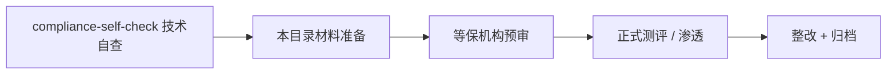

# ZestSSO 合规材料包

本目录为**中小企业上线与招投标**准备的文档模板，不构成正式测评报告。

## 文件索引

| 文档 | 用途 |
|------|------|
| [等保测评材料清单.md](等保测评材料清单.md) | 二级/三级测评前向机构提交的材料列表 |
| [渗透测试范围说明书.md](渗透测试范围说明书.md) | 委托安全厂商时的测试范围与验收标准 |
| [安全管理制度模板.md](安全管理制度模板.md) | 账号、审计、变更等制度草案 |
| [../compliance-self-check.md](../compliance-self-check.md) | 技术能力自查（已有） |

## 使用流程

## 责任分工

| 角色 | 职责 |
|------|------|
| 研发 / 运维 | 技术自查、备份策略、监控告警、整改漏洞 |
| 信息安全负责人 | 制度文档、测评对接、整改跟踪 |
| 外部机构 | 等保测评报告、渗透测试报告（盖章） |

## 预计周期（参考）

- 材料准备：1~2 周
- 等保测评（二级）：2~4 周
- 渗透测试：1~2 周
- 整改复测：1~2 周

详见 [sme-gap-closure-roadmap.md](../sme-gap-closure-roadmap.md) 阶段 C。
