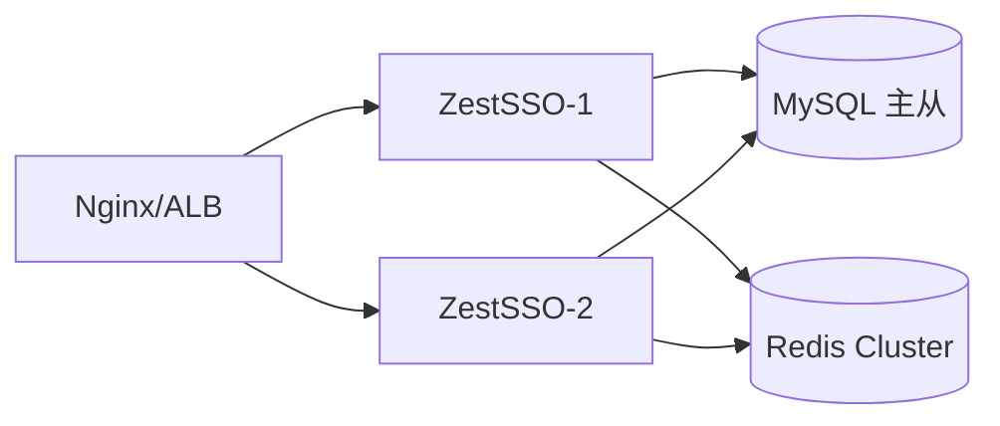

# ZestSSO 部署手册

## 1. 环境要求

| 组件 | 最低版本 | 推荐配置 |
|------|----------|----------|
| JDK | 17 | 17 LTS |
| MySQL | 8.0 | 8.0.36+ |
| Redis | 6.2 | 7.x |
| Maven | 3.6+ | 3.9+ |
| 内存 | 512MB | 2GB |
| CPU | 1 核 | 2 核 |

## 2. 单机部署

### 2.1 使用 Docker Compose 启动依赖

```bash
cd D:\project\zest\zest-sso
docker compose up -d
```

### 2.2 构建应用

```bash
mvn clean package -DskipTests
```

### 2.3 启动应用

```bash
java -jar zest-sso-server/target/zest-sso-server-1.0.0-SNAPSHOT.jar \
  --spring.datasource.url=jdbc:mysql://localhost:3306/zest_sso?useUnicode=true&characterEncoding=utf8&serverTimezone=Asia/Shanghai \
  --spring.datasource.username=root \
  --spring.datasource.password=root \
  --spring.data.redis.host=localhost \
  --zest.sso.issuer=http://localhost:9000
```

### 2.4 验证

```bash
curl http://localhost:9000/api/public/health
curl http://localhost:9000/api/public/.well-known/openid-configuration
```

## 3. 生产部署

### 3.1 环境变量

| 变量 | 说明 | 示例 |
|------|------|------|
| SPRING_DATASOURCE_URL | 数据库连接 | jdbc:mysql://db:3306/zest_sso |
| SPRING_DATASOURCE_USERNAME | 数据库用户 | zest_sso |
| SPRING_DATASOURCE_PASSWORD | 数据库密码 | *** |
| SPRING_DATA_REDIS_HOST | Redis 地址 | redis |
| SPRING_DATA_REDIS_PASSWORD | Redis 密码 | *** |
| ZEST_SSO_ISSUER | OIDC Issuer | https://sso.zest.wang |
| ZEST_SSO_JWT_PRIVATE_KEY_PATH | RSA 私钥路径 | /secrets/jwt-private.pem |
| ZEST_SSO_JWT_PUBLIC_KEY_PATH | RSA 公钥路径 | /secrets/jwt-public.pem |

### 3.2 生成 RSA 密钥

```bash
openssl genrsa -out jwt-private.pem 2048
openssl rsa -in jwt-private.pem -pubout -out jwt-public.pem
```

### 3.3 application-prod.yml

启动时指定 `--spring.profiles.active=prod`，或设置环境变量 `SPRING_PROFILES_ACTIVE=prod`。

```yaml
zest:
  sso:
    issuer: https://sso.zest.wang
    jwt:
      key-id: zest-sso-prod-key-1
      private-key-path: /secrets/jwt-private.pem
      public-key-path: /secrets/jwt-public.pem
    bootstrap:
      reset-default-password: false
    security:
      cors-allowed-origins: https://flow.zest.wang,https://llm.zest.wang
```

### 3.4 构建 Admin 控制台静态资源

```powershell
# Windows
.\scripts\build-admin.ps1

# 或手动
cd zest-sso-admin && npm run build
# 产物复制到 zest-sso-server/src/main/resources/static/admin/
```

生产访问：`https://sso.zest.wang/admin/`（与后端同域，无需额外 CORS）

### 3.5 高可用集群



部署要点：
- 多实例无状态部署，Session 存 Redis
- JWT 密钥所有实例共享同一 RSA 密钥对
- MySQL 主从 + Redis Cluster/Sentinel
- Nginx 反向代理 + HTTPS 终结

### 3.6 Nginx 配置示例

```nginx
upstream zest_sso {
    server 127.0.0.1:9000;
    server 127.0.0.1:9001;
}

server {
    listen 443 ssl;
    server_name sso.zest.wang;

    ssl_certificate     /etc/ssl/sso.crt;
    ssl_certificate_key /etc/ssl/sso.key;

    location / {
        proxy_pass http://zest_sso;
        proxy_set_header Host $host;
        proxy_set_header X-Real-IP $remote_addr;
        proxy_set_header X-Forwarded-For $proxy_add_x_forwarded_for;
        proxy_set_header X-Forwarded-Proto $scheme;
    }
}
```

## 4. 数据库运维

### 4.1 初始化

Flyway 自动执行 `db/migration/V1__init_schema.sql`

### 4.2 备份

```bash
mysqldump -u root -p zest_sso > zest_sso_backup.sql
```

### 4.3 监控指标

- HikariCP 连接池活跃连接数
- Redis 内存使用率
- 登录失败率（审计日志）
- Token 签发 QPS

## 5. 故障排查

| 现象 | 可能原因 | 处理 |
|------|----------|------|
| 启动失败 | MySQL/Redis 不可达 | 检查连接配置 |
| 登录 429 | IP 限流触发 | 等待 60s 或调整限流配置 |
| OIDC 回调失败 | redirect_uri 不匹配 | 检查客户端注册 |
| JWT 验证失败 | 密钥不一致 | 确保所有实例使用相同 RSA 密钥 |

## 6. 升级流程

1. 备份数据库
2. 停止旧版本
3. 部署新版本 JAR
4. Flyway 自动迁移
5. 验证健康检查和 OIDC 端点
6. 逐步切流

## 7. Kubernetes（Helm）

中小企业推荐使用 Helm 小集群部署（2 副本 + Ingress TLS）：

```bash
# 1. 构建并推送镜像
mvn -pl zest-sso-server -am package -DskipTests
docker build -t registry.example.com/zest/zest-sso-server:1.0.0-SNAPSHOT -f deploy/Dockerfile .

# 2. 准备 Secret（MySQL / Redis / JWT PEM）
kubectl create secret generic zest-sso-mysql --from-literal=password='***'
kubectl create secret generic zest-sso-redis --from-literal=password='***'
kubectl create secret generic zest-sso-jwt \
  --from-file=jwt-private.pem=./jwt-private.pem \
  --from-file=jwt-public.pem=./jwt-public.pem

# 3. 修改 deploy/helm/zest-sso/values.yaml 后安装
helm lint deploy/helm/zest-sso
helm upgrade --install zest-sso deploy/helm/zest-sso -n iam --create-namespace
```

监控：导入 `deploy/monitoring/grafana-zest-sso-dashboard.json`，加载 `prometheus-alerts.yaml`。

备份：每日执行 `scripts/backup-prod.ps1` 或 `scripts/backup-prod.sh`（见 §4.2）。

## 8. 中小企业补齐包

| 主题 | 文档 |
|------|------|
| 差距闭环路线图 | [docs/sme-gap-closure-roadmap.md](docs/sme-gap-closure-roadmap.md) |
| 钉钉/企微/飞书 | [docs/domestic-idp-guide.md](docs/domestic-idp-guide.md) |
| RP 集成 Cookbook | [docs/rp-integration-cookbook.md](docs/rp-integration-cookbook.md) |
| 合规材料 | [docs/compliance/README.md](docs/compliance/README.md) |
