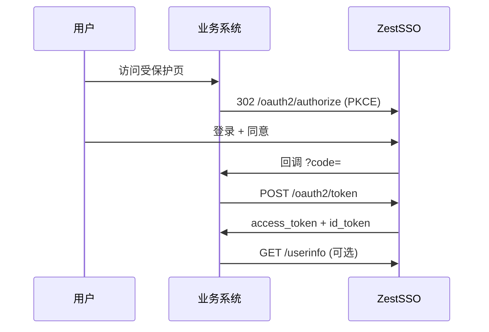

# RP 集成 Cookbook（中小企业版）

> 将业务系统接入 ZestSSO 的实操手册。完整协议说明见 [integration-guide.md](integration-guide.md)。

## 选型速查

| 系统类型 | 推荐模式 | 模板 |
|----------|----------|------|
| Spring Boot 后端 + 前端分离 | OIDC 授权码 + PKCE | `templates/rp/spring-boot-zest-sso.yml` |
| Vue / React SPA | 授权码 + PKCE，回调换票 | `templates/rp/vue-oidc-callback.md` |
| Node.js / Express | 授权码 + PKCE | `templates/rp/node-oidc-client.js` |
| 已有本地 JWT 管理后台 | SSO 登录 + 本地 JWT + Back-Channel | [zestflow-backchannel-integration.md](zestflow-backchannel-integration.md) |
| 服务间调用 | Client Credentials | Admin 注册 confidential 客户端 |
| CLI / 无浏览器设备 | Device Authorization Grant | integration-guide §4.4 |

## 标准接入流程（5 步）



### Step 1 — Admin 注册 OAuth 客户端

```http
POST /api/admin/clients
Content-Type: application/json

{
  "clientId": "my-app",
  "clientName": "我的应用",
  "redirectUris": "http://localhost:3000/login/callback",
  "scopes": "openid,profile,email,roles",
  "authorizationGrantTypes": "authorization_code,refresh_token",
  "requirePkce": true,
  "backchannelLogoutUri": "https://my-app.example.com/auth/backchannel-logout",
  "postLogoutRedirectUri": "http://localhost:3000/login"
}
```

### Step 2 — 配置 Issuer 与 Discovery

```
Issuer:     https://sso.example.com
Discovery:  https://sso.example.com/api/public/.well-known/openid-configuration
JWKS:       https://sso.example.com/oauth2/jwks
```

### Step 3 — 实现登录跳转（PKCE）

各语言模板见 `docs/templates/rp/`。

### Step 4 — 配置 Back-Channel Logout（强烈建议）

1. RP 实现 `POST /auth/backchannel-logout`，验证 `logout_token`（SDK：`ZestSsoLogoutTokenValidator`）
2. 本地 JWT / Session 按用户名或 `sid` 吊销
3. 客户端登记 `backchannelLogoutUri`
4. 联调：`scripts` 参考 ZestFlow / ZestLLM 的 `sso-backchannel-e2e.ps1`

### Step 5 — 验收

```powershell
# 替换为你的 RP 健康检查与登录 URL
curl https://sso.example.com/api/public/.well-known/openid-configuration
# 业务侧：登录 → 受保护 API 200 → SSO Admin 登出 → 业务 API 401/403
```

## 场景食谱

### 食谱 A：Spring Boot + zest-sso-client-sdk

1. 依赖 `zest-sso-client-sdk`
2. 复制 `spring-boot-zest-sso.yml`
3. 启用 `zest.sso.client.enabled=true`
4. 使用 `ZestSsoOidcClient.buildAuthorizationUrl()` 与回调换票

### 食谱 B：Vue 3 SPA

1. 前端保存 `code_verifier` / `state` 到 sessionStorage
2. 回调页 `POST` 自家后端 `/api/auth/sso/callback` 换票（**不要**在前端存 client_secret）
3. 后端 Set-Cookie 或返回 BFF JWT

### 食谱 C：多租户 SaaS

1. Token 中带 `tenant` claim（ZestSSO 已支持 scope/claim 扩展）
2. RP 按 `tenant` 隔离数据
3. Admin 使用 `TENANT_ADMIN` 管理本租户用户

### 食谱 D：SCIM 自动开户

```
HR/脚本 → SCIM POST /scim/v2/Users → ZestSSO 创建用户 → 用户首次联邦/密码登录
```

Bearer Token：Admin 创建的 SCIM API Token。

## 联调检查清单

- [ ] `redirect_uri` 与注册完全一致（含 trailing slash）
- [ ] PKCE `S256` 与 `require_pkce` 一致
- [ ] 生产 `issuer` 与浏览器地址栏同源（避免混合 http/https）
- [ ] CORS / `zest.sso.security.cors-allowed-origins` 含前端域
- [ ] Back-Channel URI 可被 SSO 服务器访问（内网需 DNS/hosts）
- [ ] 时钟同步（JWT `exp` 校验）

## 参考实现

| 项目 | 路径 |
|------|------|
| ZestFlow | `zestflow` 仓库 `sso-backchannel-e2e.ps1` |
| ZestLLM | `zest-llm/deploy/scripts/sso-backchannel-e2e.ps1` |
| Java SDK | `zest-sso-client-sdk` |
| Node SDK | `zest-sso-client-sdk-node/index.js` |
